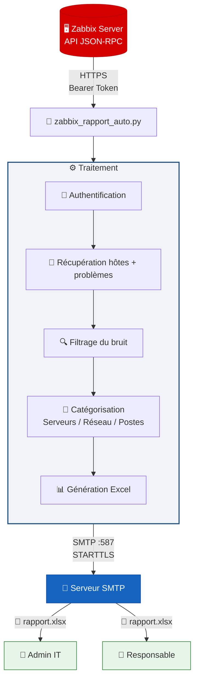

<div align="center">

# 📊 Zabbix Auto Report

**Rapports de supervision automatisés par email**

Génère un rapport Excel complet depuis l'API Zabbix et l'envoie par email chaque semaine.


</div>

---

## 🎯 Pourquoi ce projet ?

Zabbix envoie des **alertes unitaires** par email quand quelque chose ne va pas. Mais il manque une **vue d'ensemble hebdomadaire** pour savoir où en est le parc. Ce script comble ce manque :

> Chaque lundi à 7h → un rapport Excel tombe dans ta boîte mail avec l'état complet de ton infra.

---

## ✨ Fonctionnalités

| Fonctionnalité | Description |
|---|---|
| 🔍 **Filtrage intelligent** | Exclut le bruit (alertes info, changements de vitesse réseau, mises à jour OS, services Google) |
| 📂 **Catégorisation** | Problèmes regroupés : Serveurs, Réseau, Postes, Périphériques |
| 📈 **Dashboard exécutif** | Métriques clés en haut : hôtes up/down, alertes critiques, alertes filtrées |
| 🚨 **Points d'attention** | Alertes Haut/Désastre mises en évidence en rouge |
| 🎨 **Design soigné** | Lignes alternées, badges de sévérité, onglets colorés |
| 📧 **Envoi automatique** | SMTP avec TLS, pièce jointe Excel |
| ⏰ **Planification cron** | Chaque lundi 7h (personnalisable) |

---

## 📋 Contenu du rapport

Le fichier Excel généré contient **3 onglets** :

### Onglet 1 — Rapport Hebdo

Métriques du parc en haut (total, disponibles, down, alertes, critiques, filtrées), puis les problèmes classés par catégorie avec codes couleur de sévérité.

**Catégories :**
- 🔵 **Serveurs** — Disques pleins, agents down, services arrêtés
- 🟠 **Équipements réseau** — Switches down, interfaces down, ping perdu
- 🟢 **Postes de travail** — Problèmes sur les machines Windows/Linux
- 🟣 **Périphériques** — Imprimantes, etc.

### Onglet 2 — Inventaire Hôtes

Liste complète des machines supervisées avec IP, agent, état, disponibilité et catégorie. Hôtes down surlignés en rouge.

### Onglet 3 — Alertes filtrées

Tout ce qui a été exclu du rapport principal, avec la raison. Pour vérifier qu'on ne rate rien d'important.

---

## 🚀 Installation

### 1. Dépendances

```bash
pip3 install openpyxl --break-system-packages
```

### 2. Créer un compte API dans Zabbix

> ⚠️ Ne pas utiliser le compte Admin — créer un compte dédié.

1. **Utilisateurs** → **Créer un utilisateur**
2. Nom : `rapport-auto`
3. Groupe : **Zabbix administrators**
4. Rôle : **Admin role**

### 3. Déployer le script

```bash
mkdir -p /chemin/vers/rapports_zabbix
# Copier zabbix_rapport_auto.py dans ce dossier
```

### 4. Configurer

Modifier le bloc de configuration en haut du script :

```python
# 🔌 Connexion Zabbix
ZABBIX_URL  = "https://votre-zabbix/api_jsonrpc.php"
ZABBIX_USER = "rapport-auto"
ZABBIX_PASS = "VotreMotDePasse"

# 📧 Email
SMTP_SERVER = "smtp.votre-provider.com"
SMTP_PORT   = 587
SMTP_USER   = "votre_compte"
SMTP_PASS   = "votre_mdp"
SMTP_FROM   = "Zabbix <alertes@domaine.com>"
EMAIL_TO    = ["admin@domaine.com"]
```

### 5. Tester

```bash
# Tester l'envoi d'email
python3 zabbix_rapport_auto.py --test-email

# Générer + envoyer un rapport
python3 zabbix_rapport_auto.py

# Générer sans envoyer
python3 zabbix_rapport_auto.py --no-email
```

### 6. Automatiser

```bash
# Chaque lundi à 7h
(crontab -l 2>/dev/null; echo "0 7 * * 1 /usr/bin/python3 /chemin/vers/zabbix_rapport_auto.py >> /chemin/vers/cron.log 2>&1") | crontab -
```

---

## 🔧 Personnalisation

### Filtres

Ajoutez des patterns pour exclure d'autres types d'alertes :

```python
EXCLUDED_PATTERNS = [
    r"Ethernet has changed to lower speed",
    r"Operating system description has changed",
    r"GoogleUpdater",
    r"Number of installed packages has been changed",
    # Ajouter vos patterns ici
]

EXCLUDED_SEVERITIES = ["0", "1"]  # Non classé + Information
```

### Catégories

Les hôtes sont classés automatiquement. Ajustez les mots-clés :

```python
NETWORK_KEYWORDS = ["aruba", "hp-2530", "switch", "cisco"]
NETWORK_AGENTS   = ["2"]  # SNMP = réseau
```

### Destinataires

```python
EMAIL_TO = [
    "admin@domaine.com",
    "equipe-it@domaine.com",
]
```

---

## 🏗️ Architecture



---

## ⚠️ Notes Zabbix 7.x

Deux changements importants par rapport aux versions précédentes :

**Authentification** — L'ancien paramètre `auth` dans le body JSON ne fonctionne plus. Utiliser le header HTTP :
```python
headers["Authorization"] = f"Bearer {auth_token}"
```

**Tri des problèmes** — `sortfield: ["severity", "clock"]` n'est plus accepté :
```python
# ❌ Ne fonctionne plus
"sortfield": ["severity", "clock"]

# ✅ Correct
"sortfield": "eventid"
```

---

## 🔥 Dépannage Zabbix Server bloqué

Si le service est en `deactivating (stop-sigterm)` depuis longtemps :

```bash
sudo systemctl kill -s SIGKILL zabbix-server
sudo systemctl start zabbix-server
systemctl status zabbix-server
```

---

## 🗂️ Structure

```
rapports_zabbix/
├── 📄 zabbix_rapport_auto.py          # Script principal
├── 📝 cron.log                        # Logs d'exécution
└── 📊 rapport_zabbix_2026-03-09.xlsx  # Rapports générés
```

---

## 🐛 Dépannage

| Erreur | Cause | Solution |
|---|---|---|
| `ModuleNotFoundError: openpyxl` | Pas installé | `pip3 install openpyxl --break-system-packages` |
| `No module email.mime.base64` | Mauvais import | Corriger en `from email.mime.base import MIMEBase` |
| `Invalid parameter "auth"` | Zabbix 7.x | Utiliser `Authorization: Bearer` dans le header |
| `Invalid parameter "/sortfield/1"` | Zabbix 7.x | `"sortfield": "eventid"` |
| Rapport non reçu | Cron | `cat cron.log` pour voir les erreurs |
| Trop de bruit | Filtrage | Ajouter des patterns dans `EXCLUDED_PATTERNS` |

---

## 📄 Licence

MIT — Libre d'utilisation et de modification.
